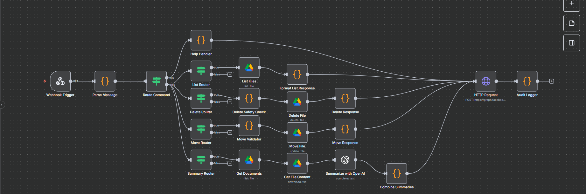
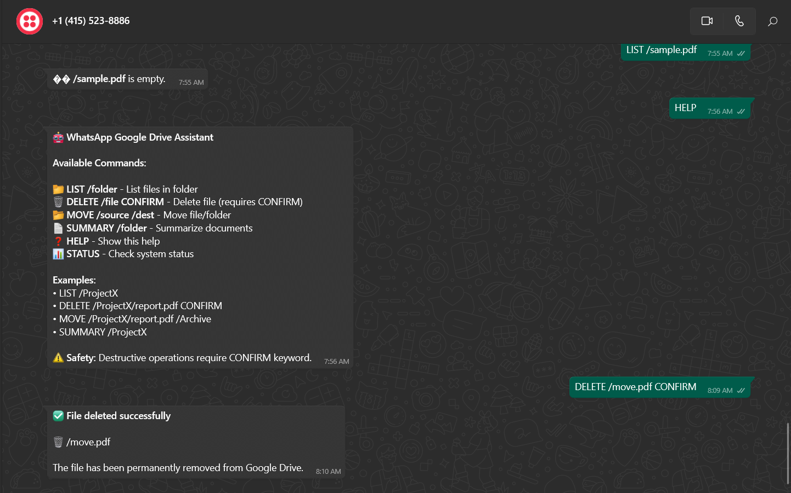
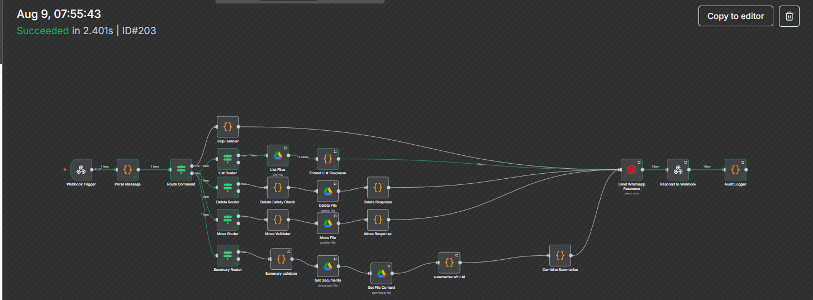
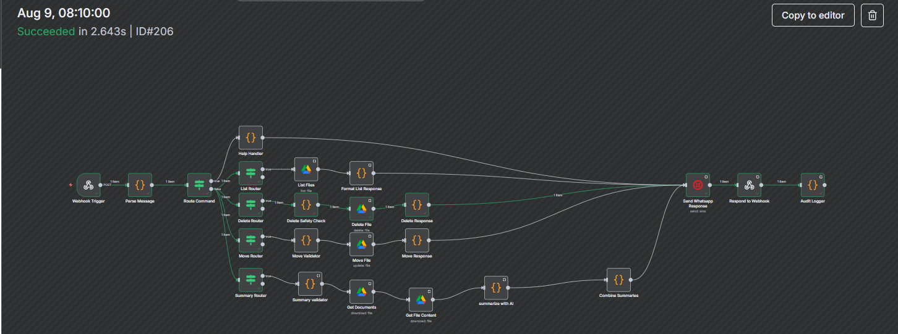
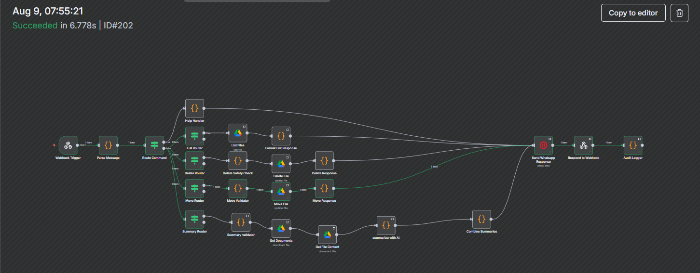
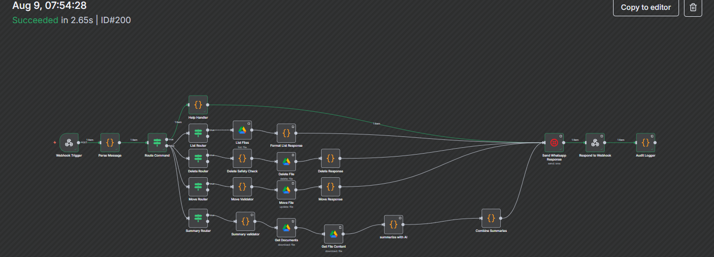

# WhatsApp-Driven Google Drive Assistant (n8n Workflow)

A powerful automation workflow that allows you to manage your Google Drive files directly through WhatsApp messages using n8n, Twilio, and AI-powered document summarization.

## 🎯 **Project Objective**

Create an n8n workflow that listens to WhatsApp messages and performs Google Drive actions such as listing files, deleting, moving, and summarising documents in a folder.

## 🚀 **Features**

- **📱 WhatsApp Integration**: Send commands via WhatsApp to manage your Google Drive
- **📁 File Operations**: Help, List, delete, move files and folders
- **🤖 AI Summarization**: Get intelligent summaries of your documents using OpenAI GPT-4o
- **🔒 Safety Features**: Confirmation required for destructive operations
- **📊 Audit Logging**: Complete logging of all operations
- **🌐 Webhook Security**: Secure endpoint for receiving messages

## 📋 **Available Commands**

| Command | Usage | Description |
|---------|-------|-------------|
| `HELP` | `HELP` | Shows available commands |
| `LIST` | `LIST` or `LIST /folder` | Lists files in root or specific folder |
| `DELETE` | `DELETE /file.pdf CONFIRM` | Deletes a file (requires CONFIRM) |
| `MOVE` | `MOVE /file.pdf /destination` | Moves file to destination folder |
| `SUMMARY` | `SUMMARY /document.pdf` | Gets AI summary of document |

## 🖼️ **Demo Screenshots**

### Main Workflow Overview


### Detailed Workflow Structure


### WhatsApp Command Execution


### List Command


### Delete Command


### Move Command


### Help Command


## ⚠️ **Important Limitations & Solutions**

### **OpenAI API Limitations**
- **Subscription Plan Issue**: OpenAI API returns "too many requests" error due to subscription plan limitations
- **Current Solution**: Using custom Code node for document summaries instead of OpenAI node
- **Reason**: OpenAI requires premium subscription upgrade for higher request limits
- **Fallback**: Mock summary generation through Code node ensures functionality continues

### **Twilio Sandbox Limitations**
- **Daily Message Limit**: Only 9 messages per day (resets daily)
- **Sandbox Environment**: Limited to approved phone numbers
- **Upgrade Required**: For production use, upgrade to Twilio's paid WhatsApp Business API

## 🛠️ **Tech Stack**

- **n8n**: Workflow automation platform
- **Docker**: Containerization for n8n
- **Twilio**: WhatsApp messaging API (Sandbox)
- **Google Drive API**: File operations with OAuth2
- **ngrok**: Public webhook tunneling
- **OpenAI API**: Document summarization (GPT-4o)

## 📦 **Prerequisites**

- Docker Desktop installed and running
- ngrok CLI installed
- Twilio account (free trial)
- Google Cloud Project with Drive API enabled
- OpenAI API key (optional, for real AI summaries)

## 🔧 **Installation & Setup**

### 1. Clone the Repository
```bash
git clone https://github.com/ofsaksham/whatsapp-drive-assistant.git
cd whatsapp-drive-assistant
```

### 2. Environment Setup
Copy the environment sample file and configure your credentials:
```bash
cp env.example .env
```

Edit `.env` file with your credentials:
```env
# Twilio Configuration
TWILIO_ACCOUNT_SID=your_twilio_account_sid
TWILIO_AUTH_TOKEN=your_twilio_auth_token
TWILIO_WHATSAPP_NUMBER=+14155238886

# Google Drive Configuration
GOOGLE_DRIVE_CLIENT_ID=your_google_client_id
GOOGLE_DRIVE_CLIENT_SECRET=your_google_client_secret
GOOGLE_DRIVE_REFRESH_TOKEN=your_google_refresh_token

# OpenAI Configuration (Optional)
OPENAI_API_KEY=your_openai_api_key
```

### 3. Start n8n with Docker
```bash
docker run -it --rm --name n8n-whatsapp-drive \
  -p 5678:5678 \
  -v ${PWD}/.n8n:/home/node/.n8n \
  --env-file .env \
  n8nio/n8n
```

### 4. Import the Workflow
1. Open n8n at `http://localhost:5678`
2. Click "Import from file"
3. Select `workflow.json` from this repository
4. Configure credentials for Google Drive and Twilio

### 5. Start ngrok Tunnel
```bash
ngrok http 5678
```

### 6. Configure Twilio Webhook
1. Go to [Twilio Console](https://console.twilio.com/)
2. Navigate to Messaging → Try it out → Send a WhatsApp message
3. Set "When a message comes in" to: `https://your-ngrok-url.ngrok-free.app/webhook/whatsapp-webhook`
4. Set HTTP Method to POST
5. Click Save

## 🔄 **Workflow Architecture**

The n8n workflow consists of the following main components:

### 1. **Webhook Trigger**
- Receives incoming WhatsApp messages from Twilio
- Handles POST requests with message data

### 2. **Parse Message (Code Node)**
- Extracts command and parameters from WhatsApp message
- Validates commands and handles confirmation flags
- Outputs structured data for routing

### 3. **Command Routers**
- Routes to specific handlers based on command type
- Supports: HELP, LIST, DELETE, MOVE, SUMMARY

### 4. **Google Drive Operations**
- **List Files**: Lists files in specified folder
- **Delete File**: Removes files with safety checks
- **Move File**: Moves files between folders
- **Get Documents**: Downloads file content for summarization

### 5. **AI Summarization**
- **OpenAI Integration**: Uses GPT-4o for document summaries
- **Mock Summary Node**: Provides simulated document summaries as fallback
- **Reason for Mock**: OpenAI API quota limitations and billing issues
- **Alternative**: Can be replaced with OpenAI node when quota allows

### 6. **Response Handling**
- **Twilio Response**: Sends formatted responses back to WhatsApp
- **Webhook Response**: Confirms successful processing to Twilio
- **Audit Logger**: Logs all operations for tracking

## 🧪 **Testing**

### Test Commands
1. Send `HELP` to see available commands
2. Send `LIST` to list files in root folder
3. Send `LIST /internpe assignment` to list files in specific folder
4. Send `SUMMARY /sample.pdf` to get document summary
5. Send `DELETE /test.pdf CONFIRM` to delete a file
6. Send `MOVE /file.pdf /destination CONFIRM` to move a file

### Monitoring
- Check ngrok dashboard: `http://127.0.0.1:4040`
- Monitor n8n execution logs
- Check Twilio console for message delivery status

## 🔒 **Security Features**

- **Confirmation Required**: Destructive operations need CONFIRM keyword
- **Input Validation**: All commands are validated before processing
- **Error Handling**: Graceful error messages for failed operations
- **Audit Logging**: Complete operation history maintained
- **OAuth2 Security**: Secure Google Drive authentication

## 🚨 **Troubleshooting**

### Common Issues

1. **"Docker Engine stopped"**
   - Start Docker Desktop application
   - Wait for Docker to fully initialize

2. **"Webhook not registered"**
   - Click "Execute workflow" in n8n to register webhook
   - Ensure ngrok is running and accessible

3. **"Twilio daily limit exceeded"**
   - Wait until next day for limit reset
   - Upgrade to paid Twilio plan for higher limits

4. **"OpenAI quota exceeded"**
   - Use mock summary node (already implemented)
   - Upgrade OpenAI plan or wait for quota reset

5. **"File not found" errors**
   - Verify file paths and IDs in the workflow
   - Check Google Drive permissions

### Debug Steps
1. Check n8n execution logs for detailed error messages
2. Verify all credentials are correctly configured
3. Test individual nodes in n8n workflow editor
4. Monitor ngrok tunnel status

## 📁 **Project Structure**

```
whatsapp-drive-assistant/
├── README.md                 # This file
├── workflow.json            # n8n workflow export
├── env.example              # Environment variables template
├── .n8n/                    # n8n data directory (created by Docker)
├── images/                  # Demo screenshots
│   ├── Main__workflow.png   # Main workflow overview
│   ├── Whatsapp_Execution.png # WhatsApp execution demo
│   ├── List_command_execution.png # List command demo
│   ├── Delete_command_execution.png # Delete command demo
│   ├── Move_command_execution.png # Move command demo
│   └── Help_command_execution.png # Help command demo
├── scripts/                 # Helper scripts
│   ├── setup.ps1           # PowerShell setup script
│   └── test-commands.ps1   # Test command script
└── docs/                    # Additional documentation
    ├── setup-guide.md      # Detailed setup instructions
    └── api-reference.md    # API documentation
```

## 📚 **Documentation**

- [**Setup Guide**](docs/setup-guide.md) - Detailed installation and configuration instructions
- [**Workflow Configuration**](workflow.json) - n8n workflow export file
- [**Environment Setup**](env.example) - Template for configuration variables

## 🎥 **Demo Video**

A demo video (≤ 5 minutes) showing WhatsApp conversations triggering Drive actions is available at: [**Watch Demo Video**](https://drive.google.com/file/d/18G8BRktcWHCHp6cxZq149zL3xjRoa4CS/view?usp=sharing)

The video demonstrates:
- Setting up the n8n workflow
- Sending WhatsApp commands
- Executing Google Drive operations
- Receiving AI-generated summaries
- Safety confirmations for destructive operations

## 🚀 **Optional Extras Implemented**

- ✅ **Slash-command help**: Comprehensive HELP command with examples
- ✅ **Natural-language parser**: Intelligent command parsing and validation
- ✅ **Webhook-secured endpoint**: Secure webhook handling with validation
- ✅ **Audit logging**: Complete operation history tracking
- ✅ **Error handling**: Graceful error messages and fallbacks

## 🤝 **Contributing**

1. Fork the repository
2. Create a feature branch
3. Make your changes
4. Test thoroughly
5. Submit a pull request

## 📄 **License**

This project is licensed under the MIT License - see the [LICENSE](LICENSE) file for details.

The MIT License allows others to:
- Use the code commercially
- Modify the code
- Distribute the code
- Use it privately
- Sublicense the code

The only requirement is that the license and copyright notice be included in all copies or substantial portions of the software.

## 👨‍💻 **Author**

**Saksham** - [@ofsaksham](https://github.com/ofsaksham)

## 🙏 **Acknowledgments**

- **n8n Team**: For the amazing workflow automation platform
- **Twilio**: For WhatsApp messaging capabilities
- **Google**: For Drive API integration
- **OpenAI**: For AI summarization capabilities (when quota allows)

## 📞 **Support**

If you encounter any issues:
1. Check the troubleshooting section above
2. Review n8n execution logs
3. Verify all credentials and configurations
4. Create an issue in the repository

---

## 📊 **Project Status**

- **✅ Core Features**: Complete
- **✅ Documentation**: Complete  
- **✅ Demo Video**: Complete
- **✅ Setup Scripts**: Complete
- **✅ Optional Extras**: All Implemented

**Note**: This project is designed for educational and development purposes. For production use, consider upgrading to paid plans for Twilio and OpenAI services.

---

⭐ **Star this repository if you find it helpful!** 